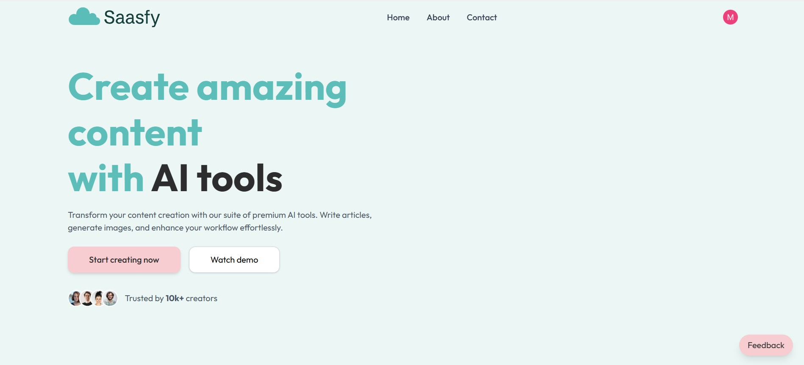
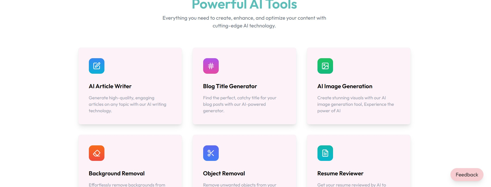
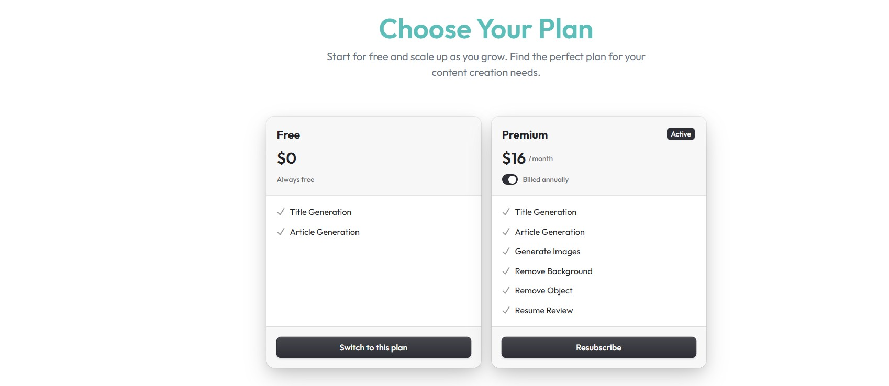
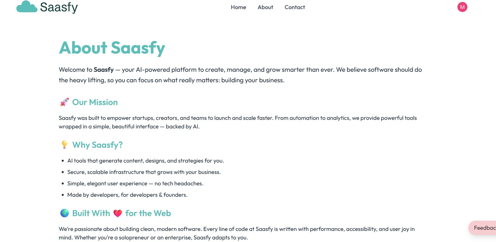
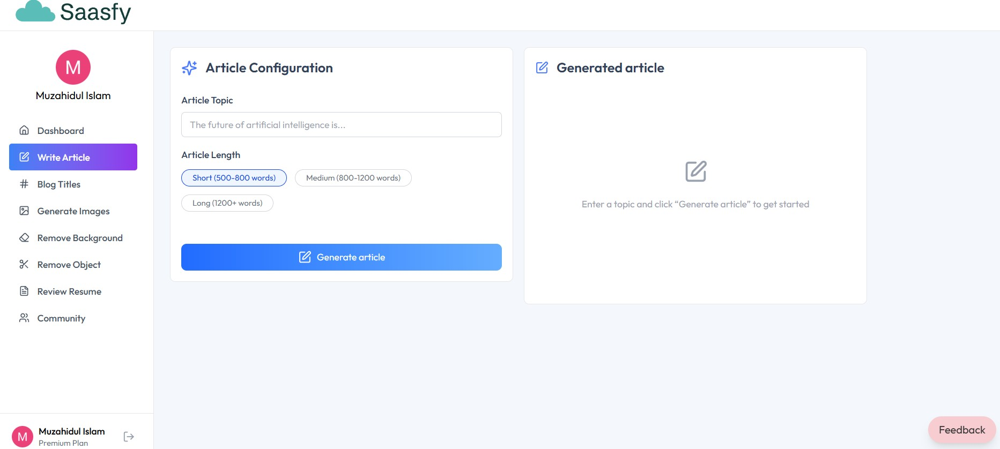
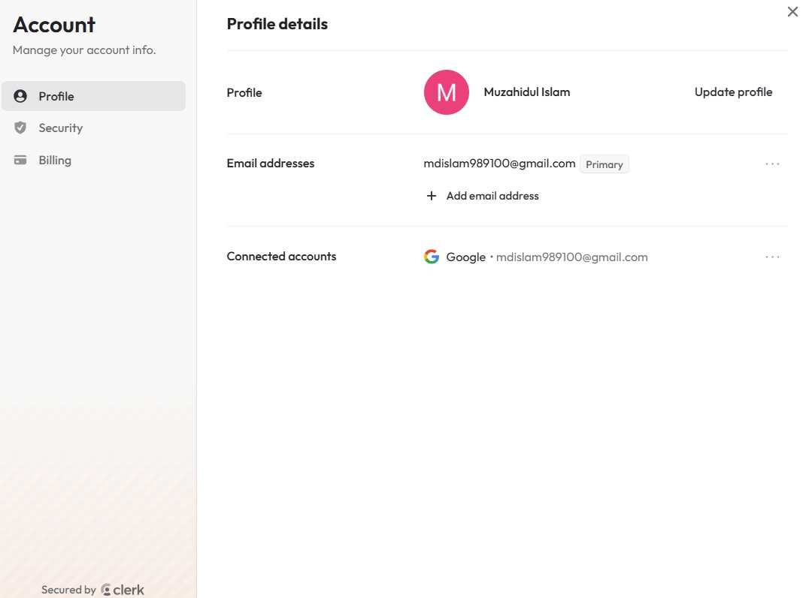

<h1>SaaSfy 🚀</h1>

SaaSfy is an all-in-one AI-powered SaaS platform to supercharge your productivity. 
Write articles, generate images, edit photos, and optimize resumes — all in one place.

<h2>🌟 Features</h2>
<ul>
  <li>✍️ <b>Write Articles & Blog Titles</b>: Generate SEO-friendly content instantly.</li>
  <li>🖼️ <b>Generate AI Images</b>: Create stunning visuals from text prompts.</li>
  <li>🧹 <b>Remove Backgrounds & Objects</b>: Clean and enhance images in seconds.</li>
  <li>📄 <b>Resume Review</b>: AI-powered feedback to optimize your resume.</li>
  <li>📥 <b>Download Outputs</b>: Save documents as PDF and images as PNG.</li>
  <li>⭐ <b>User Feedback System</b>: Share your feedback to help improve SaaSFy.</li>
  <li>💳 <b>Subscription Plans</b>: Flexible plans to suit every user.</li>
</ul>

<h2>🛠️ Built With</h2>
<ul>
  <li><b>Frontend</b>: React.js</li>
  <li><b>Authentication</b>: Clerk</li>
  <li><b>Image Management</b>: Cloudinary</li>
  <li><b>AI Integrations</b>: Neon, Gemini, ClipDrop</li>
  <li><b>Backend & Database</b>: Firebase</li>
</ul>

<h2>🎨 Screenshots / Demo</h2>
<table>
  <tr>
    <td></td>
    <td></td>
  </tr>
  <tr>
    <td></td>
    <td></td>
  </tr>
  <tr>
    <td></td>
    <td></td>
  </tr>
  <tr>
    <td></td>
  </tr>
</table>

<h2>🚀 How It Works</h2>
<ol>
  <li><b>Sign Up / Login</b> with your account (powered by Clerk).</li>
  <li><b>Select a Plan</b> that fits your needs.</li>
  <li><b>Choose a Tool</b>: Write, Generate, Edit, or Review.</li>
  <li><b>Download your Output</b> in PDF or PNG.</li>
  <li><b>Give Feedback</b> to help improve the platform.</li>
</ol>

<h2>⚡ Quick Start</h2>

<h3>1. Clone the Repository</h3>
<pre><code class="language-bash">
git clone https://github.com/muzahidul-2000/saasfy.git
</code></pre>

<h3>2. Install Dependencies</h3>
<ol type="a">
  <li><b>For Client</b>
    <pre><code class="language-bash">
cd client
npm install
    </code></pre>
  </li>
  <li><b>For Server</b>
    <pre><code class="language-bash">
cd server
npm install
    </code></pre>
  </li>
</ol>

<h3>3. Setup Environment Variables</h3>
<ol type="a">
  <li><b>Create a <code>.env</code> file</b> in both <code>client/</code> and <code>server/</code>.</li>
  <li><b>Add your API keys for:</b>
    <ul>
      <li>Clerk</li>
      <li>Firebase</li>
      <li>Neon</li>
      <li>Gemini</li>
      <li>ClipDrop</li>
      <li>Cloudinary</li>
    </ul>
  </li>
</ol>

<h3>4. Run the Application</h3>
<ol type="a">
  <li><b>For Client</b>
    <pre><code class="language-bash">
cd client
npm run dev
    </code></pre>
  </li>
  <li><b>For Server</b>
    <pre><code class="language-bash">
cd server
npm run server
    </code></pre>
  </li>
</ol>

<h2>💡 Why SaaSfy?</h2>

SaaSFy combines multiple AI tools into a single platform to <b>save time, enhance creativity, and help users achieve more</b> — whether you’re a content creator, designer, or job seeker.

<h2>📬 Feedback</h2>

We love hearing from users! Share your thoughts directly on the platform. 
Your feedback makes SaaSFy better.

<h2>🔗 Live Demo</h2>

  

<h2>🌍 Live Website</h2>

  <a href="https://saa-s-fy.vercel.app"><b>🚀 Visit SaaSfy Live</b></a>

<h2>📄 License</h2>

MIT License © 2025 Muzahidul Islam

